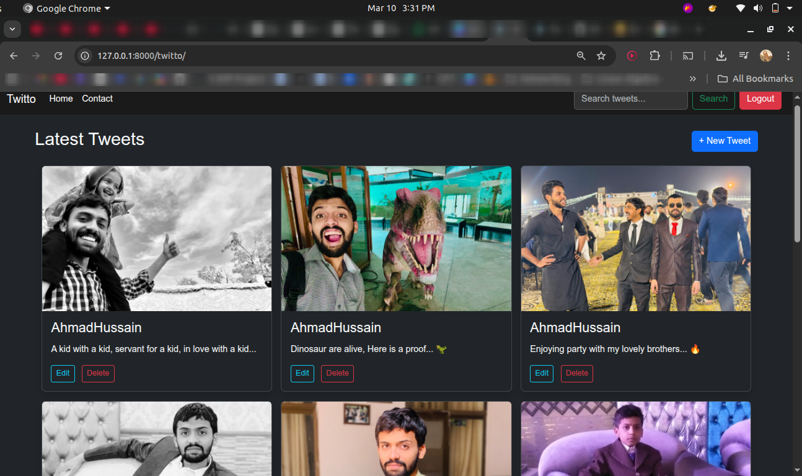
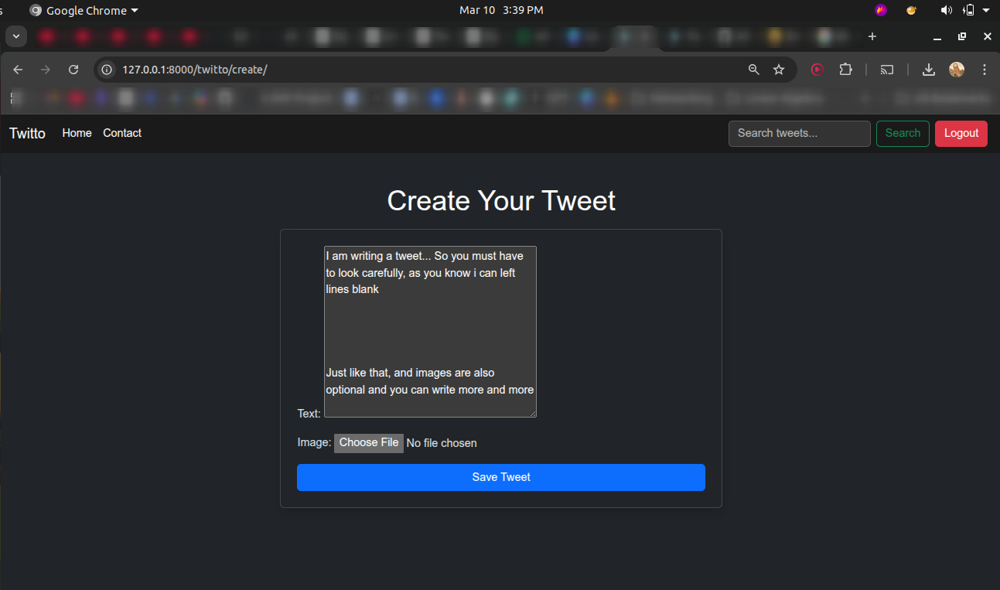
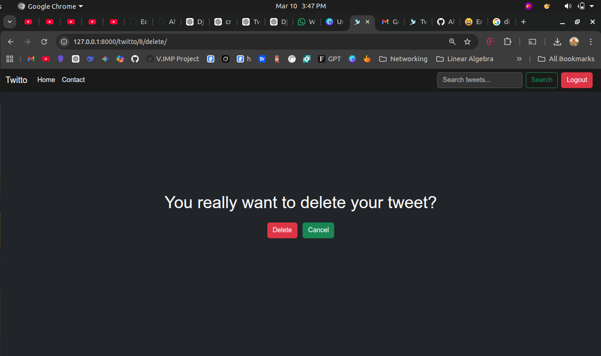
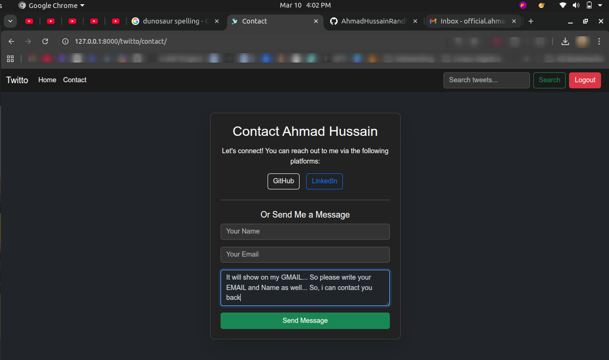
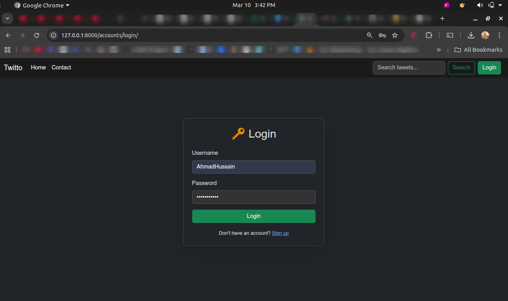

# Twitto

A **microblogging platform** built with Django, allowing users to post, edit, and delete tweets with optional images.  

Twitto demonstrates practical Django skills in models, forms, views, authentication, media handling, and responsive UI design. This project is a clean, functional example of a web application following real-world backend and frontend practices.

---

# Project Preview

## Tweet List / Homepage



---

## Create Tweet



---

## Delete Tweet Confirmation



---

## Contact Form



---

---

## Login Form



---

# Core Features

- **User Authentication:** Register, login, and logout securely.  
- **Tweet Management:** Create, edit, and delete tweets.  
- **Image Uploads:** Attach optional images to tweets.  
- **Search:** Filter tweets by keyword.  
- **Responsive UI:** Dark-mode theme using Bootstrap 5.  
- **Contact Form:** Email integration for feedback or inquiries.  

---

# Example Workflow

1. User registers an account  
2. User logs in  
3. User creates a new tweet with optional image  
4. Tweet appears on the homepage  
5. User can edit or delete their own tweets  
6. Search functionality allows filtering tweets  
7. Contact form sends messages to the configured admin email  

---

# Technical Highlights

### Backend

- Django framework with Python  
- SQLite database (development)  
- CRUD operations with class-based views and function-based views  
- Media handling with Django `ImageField`  

### Frontend

- HTML Templates with Bootstrap 5  
- Responsive dark mode layout  
- Navbar with search bar and authentication links  

### Authentication & Authorization

- Django's built-in user model  
- `@login_required` decorators for tweet creation, editing, and deletion  
- User-specific access control: users can only modify their own tweets  

### Search

- Case-insensitive text search on tweet content  
- Implemented using Django ORM filters (`icontains`)  

### Contact Form

- Validates required fields  
- Sends email to the configured admin email via SMTP  

---

# Installation

1. Clone the repository:

   ```bash
   git clone https://github.com/<your-username>/twitto.git
   cd twitto
   ```

2. Create a virtual environment and activate it:
   ```sh
   python -m venv venv
   source venv/bin/activate  # On Windows use: venv\Scripts\activate
   ```
4. Install dependencies:
   ```sh
   pip install -r requirements.txt
   ```
5. Apply migrations:
   ```sh
   python manage.py migrate
   ```
6. Run the development server:
   ```sh
   python manage.py runserver
   ```
7. Access the app at `http://127.0.0.1:8000/`

## Usage

- Register an account
- Log in to start tweeting
- Add images to your tweets
- Explore trending topics (Static for now)
- Edit or delete your own tweets

## Future Plans

- Add likes, comments, and retweets
- Implement user profiles
- Enhance UI with animations
- Integrate real-time notifications
 

# License

MIT License

---

# Contact 💀 

[ official.ahmadrandhawa@gmail.com](mailto:official.ahmadrandhawa@gmail.com)   
[  LinkedIn Profile](https://www.linkedin.com/in/ahmad-hussain-randhawa/)  
[  GitHub Profile](https://github.com/AhmadHussainRandhawa)   

---

> *"If you have any questions or want to collaborate on something, feel free to email me (without any hesitation)... I might be a little busy sometimes, but I’ll definitely reply."*